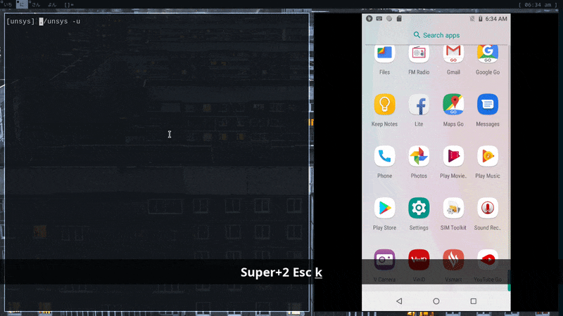

<p align="center">
    
</p>

<h1 align="center" >Script uninstall multi Android apps</h1>

# Features
- uninstall systems app without root
- reinstall app uninstalled by unsys

# Dependencies:
- adb (Android Debug Bridge)
- fzf (https://github.com/junegunn/fzf

# Usage
```
  Syntax: ./unsys -[u|i]

  Options:
  u     Uninstall apps
  i     Reinstall apps
  h     Print Help
```
